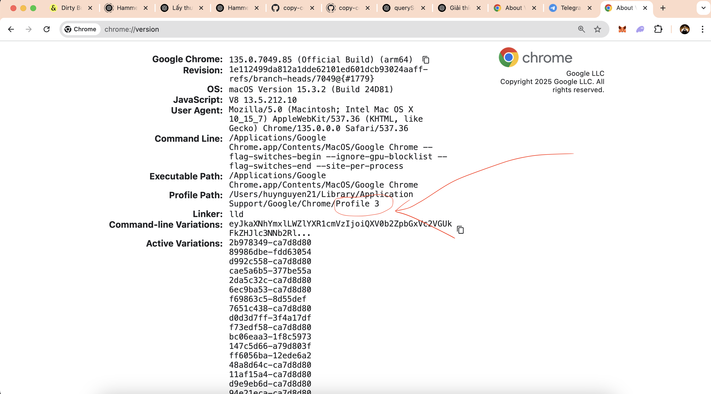

# copy-content-evand

Tool tự động sao chép nội dung từ các trang web sử dụng Playwright.

## 📋 Mô tả
Tool này được thiết kế để tự động sao chép nội dung từ các trang web, đặc biệt hữu ích cho việc trích xuất nội dung từ các trang đọc sách điện tử. Tool sử dụng Playwright để tự động hóa quá trình duyệt web và có khả năng:
- Sử dụng profile Chrome có sẵn
- Tự động chuyển trang
- Trích xuất nội dung từ các phần tử được chỉ định
- Lưu nội dung vào file văn bản

## ⚙️ Cấu hình

Tạo file `config.env` với nội dung sau:

```env
ITERATIONS=10
TARGET_URL=your_target_url
TARGET_PROFILE=Default
```

- `ITERATIONS`: Số trang cần sao chép
- `TARGET_URL`: URL của trang web cần sao chép
- `TARGET_PROFILE`: Tên profile Chrome muốn sử dụng (mặc định là "Default")

### Cách lấy TARGET_PROFILE:
1. Đăng nhập sẵn trang everand trên trình duyệt Chrome
2. Vào địa chỉ `chrome://version/`
3. Tìm dòng "Profile Path", copy tên profile (thường là Default hoặc Profile 1, Profile 2,...)



## 🎮 Sử dụng

### Windows:
```bash
./run.bat
```

### macOS/Linux:
```bash
./run.sh
```

### Các bước sử dụng:
1. Mở sách cần copy trên Everand
2. Chạy tool theo hệ điều hành
3. Tool sẽ mở trình duyệt với profile đã cấu hình
4. Đợi 10 giây để chọn trang bắt đầu copy
5. Tool sẽ tự động chuyển trang và copy nội dung


## 📝 Kết quả
- Nội dung sẽ được lưu vào file `output.txt`
- Trong trường hợp có lỗi, screenshots sẽ được lưu với tên `error-page-{số trang}.png`

## ⚠️ Lưu ý
- Tool sẽ sử dụng profile Chrome có sẵn để tận dụng các phiên đăng nhập hiện có
- Đảm bảo đã đăng nhập vào tài khoản cần thiết trước khi chạy tool